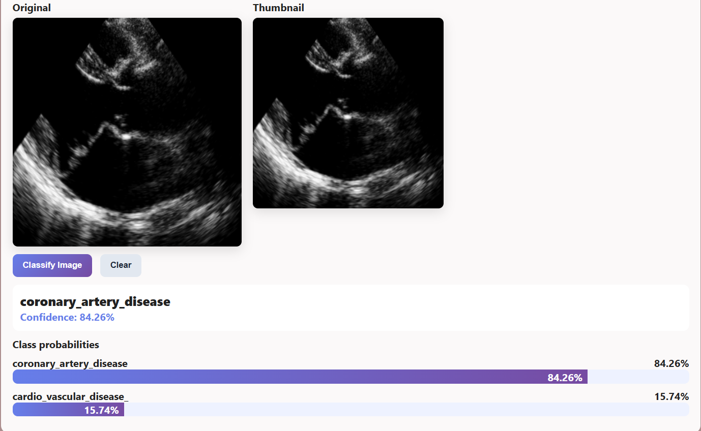
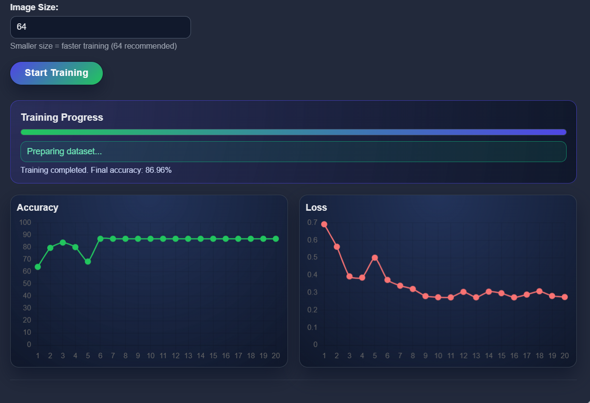
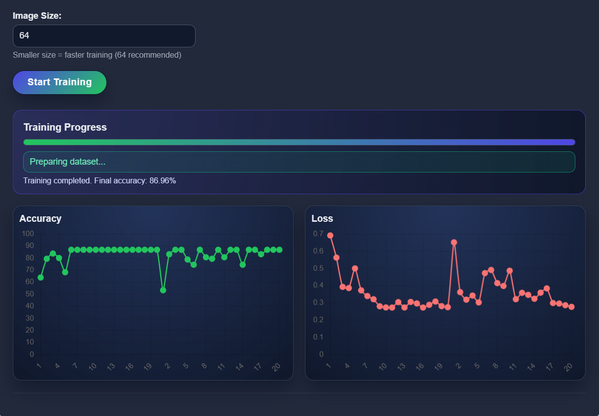

# Heart Disease Detection Using Deep Learning

## Project Overview
This project predicts heart disease using deep learning techniques and patient health data.

## Technologies Used
- Python
- TensorFlow
- Pandas
- NumPy
- Matplotlib

## Features
- Data preprocessing
- Model training
- Heart disease prediction
- Accuracy evaluation
  
## screenshots

## Author
Mungamuri Rajeswari
GitHub: https://github.com/22kn1a6340
